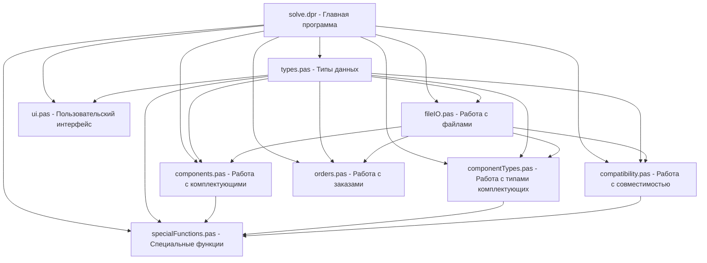
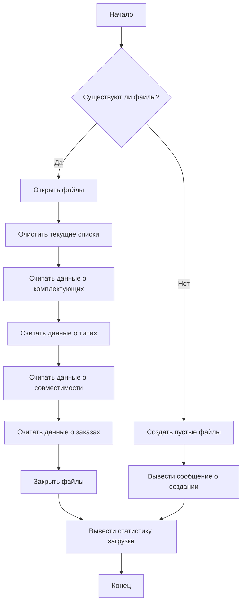
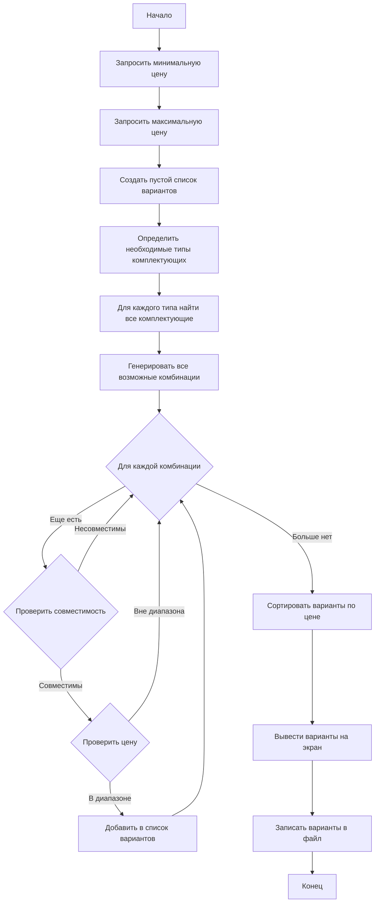
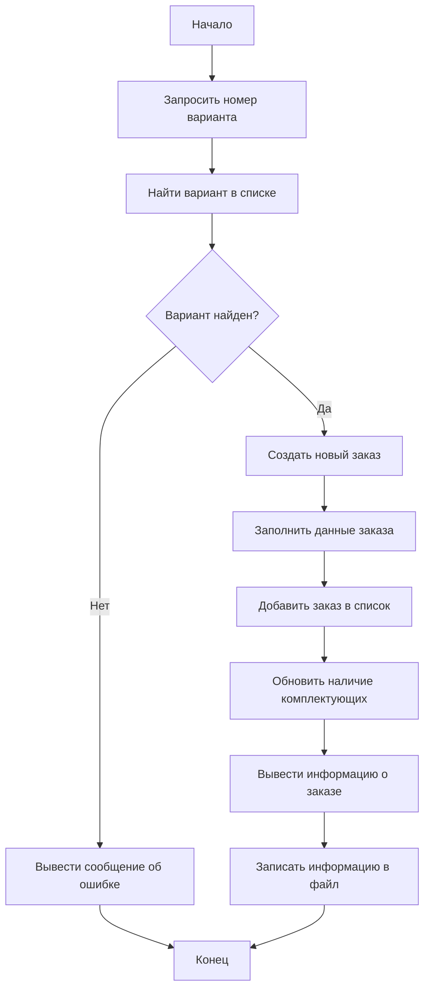
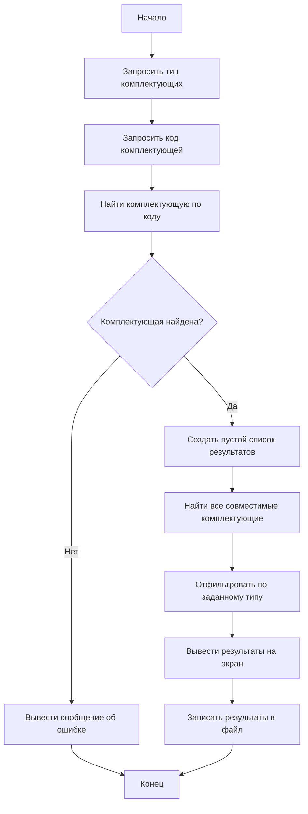

# План решения для системы учета компьютерных комплектующих

## Анализ задания

Задание требует разработать программу для работы с информацией о комплектующих компьютерной техники, которая должна:

1. Хранить и обрабатывать данные в типизированных файлах и динамических списках
2. Иметь пользовательское меню с 10 пунктами
3. Реализовать специальные функции:
   - Подбор вариантов комплектации компьютера в заданном ценовом диапазоне
   - Оформление заказа понравившегося варианта
   - Вывод совместимых комплектующих заданного типа

## Структура данных

Для реализации требуемой функциональности предлагается следующая структура данных:

```pascal
// Комплектующая
TComponent = record
  Code: Integer;           // Код комплектующей
  TypeCode: Integer;       // Код типа комплектующей
  Manufacturer: string;    // Фирма-изготовитель
  Model: string;           // Модель
  Parameters: string;      // Параметры
  Price: Real;             // Цена
  InStock: Boolean;        // Наличие
end;

// Тип комплектующей
TComponentType = record
  Code: Integer;           // Код типа
  Name: string;            // Название типа
end;

// Совместимость комплектующих
TCompatibility = record
  ComponentCode: Integer;  // Код комплектующей
  CompatibleCode: Integer; // Код совместимой комплектующей
end;

// Заказ
TOrder = record
  OrderNumber: Integer;    // Номер заказа
  Date: TDateTime;         // Дата заказа
  TotalPrice: Real;        // Общая стоимость
  Components: array of Integer; // Коды комплектующих в заказе
  ComponentCount: Integer; // Количество комплектующих в заказе
end;

// Узел списка комплектующих
PComponentNode = ^TComponentNode;
TComponentNode = record
  Data: TComponent;        // Данные о комплектующей
  Next: PComponentNode;    // Указатель на следующий узел
end;

// Узел списка типов комплектующих
PComponentTypeNode = ^TComponentTypeNode;
TComponentTypeNode = record
  Data: TComponentType;    // Данные о типе комплектующей
  Next: PComponentTypeNode; // Указатель на следующий узел
end;

// Узел списка совместимости
PCompatibilityNode = ^TCompatibilityNode;
TCompatibilityNode = record
  Data: TCompatibility;    // Данные о совместимости
  Next: PCompatibilityNode; // Указатель на следующий узел
end;

// Узел списка заказов
POrderNode = ^TOrderNode;
TOrderNode = record
  Data: TOrder;            // Данные о заказе
  Next: POrderNode;        // Указатель на следующий узел
end;

// Списки данных
TDataLists = record
  Components: PComponentNode;       // Список комплектующих
  ComponentTypes: PComponentTypeNode; // Список типов комплектующих
  Compatibilities: PCompatibilityNode; // Список совместимостей
  Orders: POrderNode;              // Список заказов
end;
```

## Архитектура программы

Предлагается модульная структура программы:



## Модули программы

### 1. types.pas
- Определение всех типов данных и структур
- Константы и глобальные переменные

### 2. components.pas
- Инициализация и освобождение списка комплектующих
- Добавление, удаление, редактирование комплектующих
- Поиск комплектующих по различным критериям
- Сортировка комплектующих

### 3. componentTypes.pas
- Инициализация и освобождение списка типов комплектующих
- Добавление, удаление, редактирование типов
- Поиск типов по коду или названию

### 4. compatibility.pas
- Инициализация и освобождение списка совместимости
- Добавление, удаление записей о совместимости
- Проверка совместимости комплектующих
- Поиск совместимых комплектующих

### 5. fileIO.pas
- Чтение и запись данных в типизированные файлы
- Проверка существования файлов
- Создание пустых файлов при первом запуске

### 6. ui.pas
- Функции для работы с пользовательским интерфейсом
- Отображение меню и подменю
- Форматированный вывод данных
- Безопасный ввод данных с валидацией

### 7. specialFunctions.pas
- Подбор вариантов комплектации компьютера
- Оформление заказа
- Поиск совместимых комплектующих заданного типа
- Запись результатов в текстовые файлы

### 8. orders.pas
- Инициализация и освобождение списка заказов
- Создание, удаление, редактирование заказов
- Поиск заказов по различным критериям

### 9. solve.dpr
- Основная программа
- Инициализация всех структур данных
- Главный цикл обработки меню
- Освобождение памяти при завершении

## Пользовательское меню

Программа будет иметь следующее меню:

1. Чтение данных из файла
2. Просмотр списка (подменю: комплектующие, типы, совместимость, заказы)
3. Сортировка данных (подменю: по цене, по наличию, по производителю)
4. Поиск данных с использованием фильтров
5. Добавление данных (подменю: комплектующие, типы, совместимость)
6. Удаление данных (подменю: комплектующие, типы, совместимость, заказы)
7. Редактирование данных (подменю: комплектующие, типы, совместимость, заказы)
8. Специальные функции:
   - Подбор комплектации компьютера
   - Оформление заказа
   - Поиск совместимых комплектующих
9. Выход без сохранения
10. Выход с сохранением

## Алгоритмы основных операций

### Чтение данных из файла



### Подбор вариантов комплектации компьютера



### Оформление заказа



### Поиск совместимых комплектующих



## Файловая структура

Программа будет использовать следующие файлы:

1. `components.dat` - типизированный файл с комплектующими
2. `types.dat` - типизированный файл с типами комплектующих
3. `compatibility.dat` - типизированный файл с данными о совместимости
4. `orders.dat` - типизированный файл с заказами
5. `configurations.txt` - текстовый файл с результатами подбора конфигураций
6. `order_info.txt` - текстовый файл с информацией о заказе
7. `compatible_components.txt` - текстовый файл с результатами поиска совместимых комплектующих

## Вопросы для уточнения

Для более детальной проработки решения мне нужно уточнить несколько моментов:
