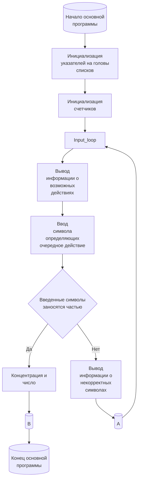
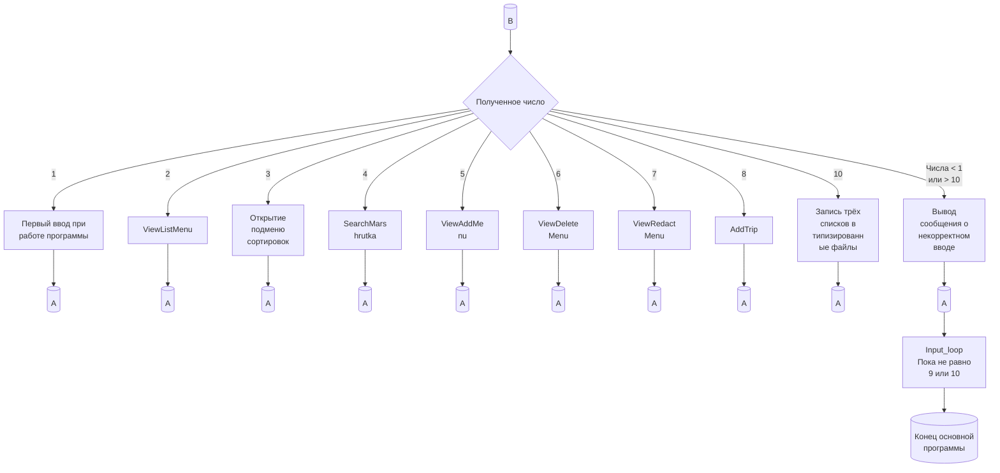
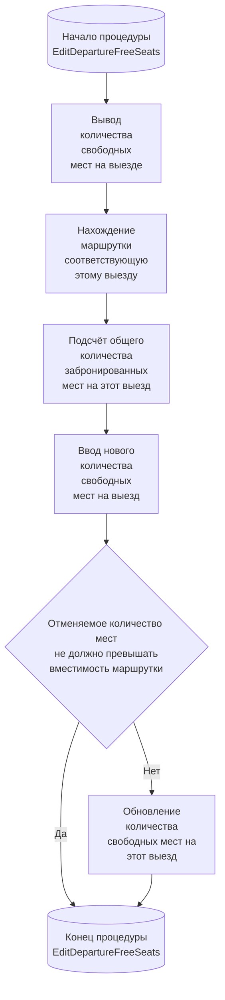
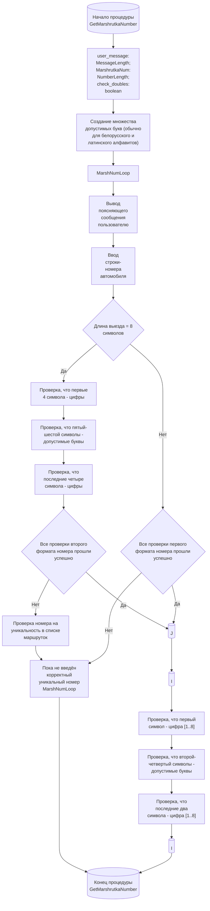
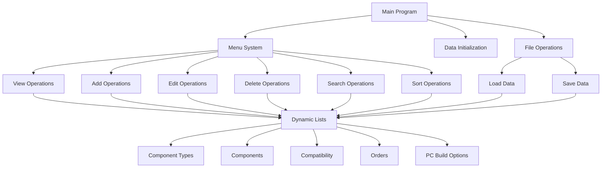

# Ключевые блоки схемы программы - Mermaid диаграммы

## 1. Главная программа (Main Program)

### Основной поток выполнения программы:

### Детальное описание главной программы:
- **Инициализация указателей** - создание и настройка динамических списков для хранения данных
- **Инициализация счетчиков** - установка начальных значений переменных
- **Input_loop** - основной цикл обработки пользовательского ввода
- **Проверка символов** - валидация введенных команд
- **Обработка действий** - выполнение соответствующих операций

## 2. Система меню программы

### Главное меню с обработкой выбора:

### Описание пунктов меню:
1. **Загрузка данных** - чтение информации из типизированных файлов
2. **Просмотр списков** - отображение всех категорий данных
3. **Сортировка** - упорядочивание данных по различным критериям
4. **Поиск маршруток** - фильтрация по заданным параметрам
5. **Добавление данных** - создание новых записей
6. **Удаление данных** - удаление выбранных записей
7. **Редактирование** - модификация существующих записей
8. **Добавление поездки** - планирование новых рейсов
10. **Сохранение и выход** - запись данных в файлы и завершение

## 3. Процедура EditDepartureFreeSeats

### Редактирование количества свободных мест:

### Детальное описание процедуры:
- **Отображение текущего состояния** - показ количества доступных мест
- **Поиск связанной маршрутки** - определение транспортного средства
- **Расчет занятости** - подсчет уже забронированных мест
- **Валидация ввода** - проверка на превышение вместимости
- **Обновление данных** - применение изменений к базе данных

## 4. Процедура GetMarshrutkaNumber

### Получение и валидация номера маршрутки:

### Детальное описание валидации:

#### Входные параметры:
- `user_message` - текст сообщения для пользователя
- `MessageLength` - длина сообщения
- `MarshrutkaNum` - переменная для хранения номера
- `NumberLength` - длина номера
- `check_doubles` - флаг проверки уникальности

#### Форматы номеров:
**Первый формат (8 символов):**
- Позиции 1-4: цифры
- Позиции 5-6: допустимые буквы (белорусский/латинский алфавит)
- Позиции 7-8: цифры

**Второй формат (6 символов):**
- Позиция 1: цифра [1..8]
- Позиции 2-4: допустимые буквы
- Позиции 5-6: цифры [1..8]

#### Проверки:
1. **Проверка длины** - соответствие одному из допустимых форматов
2. **Проверка символов** - валидация каждой позиции
3. **Проверка уникальности** - отсутствие дублирования в системе

## 5. Общая архитектура программы

### Структура взаимодействия модулей:

### Принципы работы:
- **Модульная архитектура** - разделение функциональности по модулям
- **Динамическое управление памятью** - использование связанных списков
- **Файловые операции** - сохранение/загрузка данных
- **Пользовательский интерфейс** - консольное меню с валидацией
- **Обработка ошибок** - проверка корректности данных на каждом этапе
