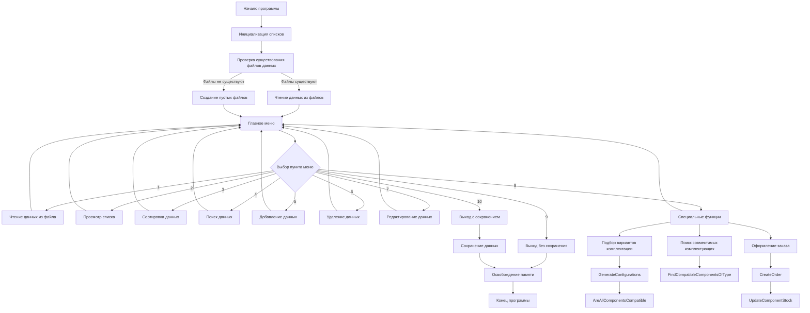
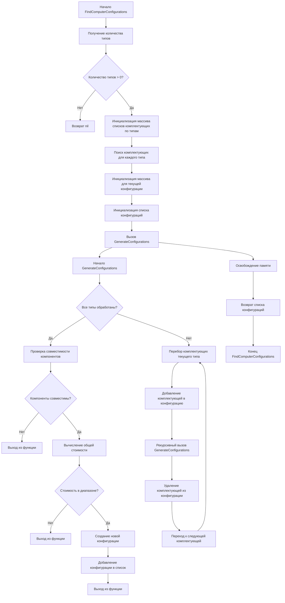
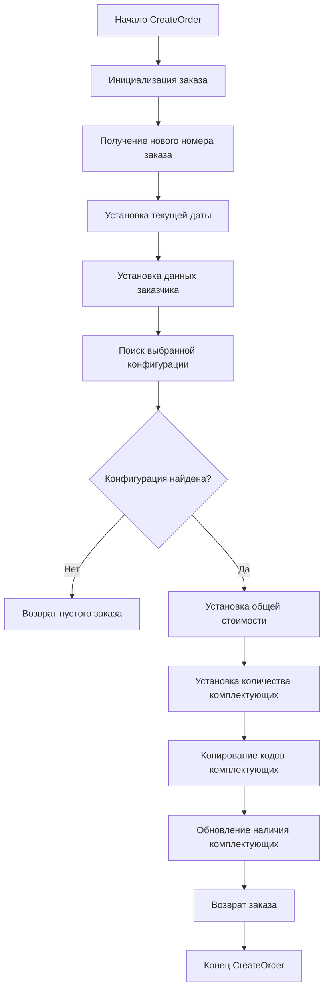
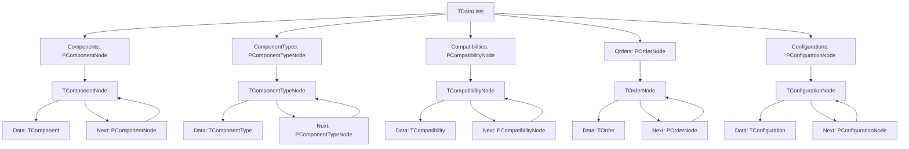

# Теоретические сведения по теме лабораторной работы

Программа представляет собой информационную систему для учета компьютерных комплектующих, их типов, совместимости и заказов. Система использует динамические структуры данных (связные списки) для хранения информации и предоставляет функциональность для работы с этими данными.

# Задание на лабораторную работу и эскиз работы программы

Разработать программу для учета компьютерных комплектующих, которая позволяет:
- Хранить информацию о комплектующих, их типах и совместимости
- Выполнять поиск, сортировку и фильтрацию данных
- Подбирать варианты комплектации компьютера в заданном ценовом диапазоне
- Оформлять заказы на основе выбранных конфигураций
- Сохранять и загружать данные из файлов

# Выполнение
## Разработка алгоритма
Схема работы программы и подпрограмм

Рисунок 3.1 – Схема работы программы

### Схема алгоритма подбора вариантов комплектации компьютера

Рисунок 3.2 – Схема алгоритма подбора вариантов комплектации компьютера

### Схема алгоритма оформления заказа

Рисунок 3.3 – Схема алгоритма оформления заказа

### Схема структуры данных

Рисунок 3.4 – Схема структуры данных

## Определение подпрограмм и их описание

Таблица 3.1 используемые идентификаторы

| Имя подпрограм-мы | Назначение подпро-граммы | Заголовок подпрограммы | Имя параметра | Назначение параметра |
| --- | --- | --- | --- | --- |
| InitComponentsList | Инициализация списка комплектующих | procedure InitComponentsList | - | - |
| AddComponent | Добавление комплектующей в список | procedure AddComponent(const Component: TComponent) | Component | Данные о комплектующей |
| FindComponentByCode | Поиск комплектующей по коду | function FindComponentByCode(Code: Integer): PComponentNode | Code | Код комплектующей |
| SortComponentsByPrice | Сортировка комплектующих по цене | procedure SortComponentsByPrice(var List: PComponentNode) | List | Список комплектующих |
| FindComputerConfigurations | Подбор вариантов комплектации компьютера | function FindComputerConfigurations(MinPrice, MaxPrice: Real; SelectedTypes: array of Integer): PConfigurationNode | MinPrice, MaxPrice, SelectedTypes | Минимальная цена, максимальная цена, массив кодов типов |
| CreateOrder | Оформление заказа | function CreateOrder(ConfigurationIndex: Integer; const CustomerName, CustomerPhone: string): TOrder | ConfigurationIndex, CustomerName, CustomerPhone | Индекс конфигурации, имя заказчика, телефон заказчика |
| FindCompatibleComponentsOfType | Поиск совместимых комплектующих | function FindCompatibleComponentsOfType(ComponentCode, TypeCode: Integer): PComponentNode | ComponentCode, TypeCode | Код комплектующей, код типа |
                
## Выделение основных структур данных
Таблица 3.2  используемые идентификаторы
| Имя идентификатора структуры | Назначение структуры | Тип структуры |
| TComponent | Хранение информации о комплектующей | Запись (record) |
| TComponentType | Хранение информации о типе комплектующей | Запись (record) |
| TCompatibility | Хранение информации о совместимости комплектующих | Запись (record) |
| TConfiguration | Хранение информации о конфигурации компьютера | Запись (record) |
| TOrder | Хранение информации о заказе | Запись (record) |
| TComponentNode | Узел списка комплектующих | Запись (record) |
| TComponentTypeNode | Узел списка типов комплектующих | Запись (record) |
| TCompatibilityNode | Узел списка совместимости | Запись (record) |
| TOrderNode | Узел списка заказов | Запись (record) |
| TConfigurationNode | Узел списка конфигураций | Запись (record) |
| TDataLists | Хранение всех списков данных | Запись (record) |

## Пример описание структур в виде таблиц

TComponent Таблица 3.3 пример заполнения реальными данными
| Code | TypeCode | Manufacturer | Model | Parameters | Price | InStock |
| --- | --- | --- | --- | --- | --- | --- |
| 1 | 1 | Intel | Core i5-12400F | "cores:6,threads:12,frequency:2.5" | 12000.00 | True |
| 2 | 2 | ASUS | TUF Gaming B660M-PLUS | "socket:LGA1700,chipset:B660" | 15000.00 | True |
| 3 | 3 | Kingston | FURY Beast DDR4 | "capacity:16GB,frequency:3200MHz" | 5000.00 | True |

TOrder Таблица 3.4 пример заполнения реальными данными
| OrderNumber | Date | CustomerName | CustomerPhone | TotalPrice | Components | ComponentCount |
| --- | --- | --- | --- | --- | --- | --- |
| 1 | 10.04.2025 | Иванов И.И. | +375291234567 | 32000.00 | [1, 2, 3] | 3 |

## Тестирование и отладка программы
Таблица 3.5 Прохождение тестов программы
| Номер теста | Вводимые данные | Ожидаемый результат | Полученный результат |
| --- | --- | --- | --- |
| 1 | Добавление комплектующей: Code=4, TypeCode=4, Manufacturer="Nvidia", Model="RTX 3060", Parameters="memory:12GB", Price=30000.00, InStock=True | Комплектующая успешно добавлена | Комплектующая успешно добавлена |
| 2 | Поиск комплектующей по коду: Code=4 | Найдена комплектующая с кодом 4 | Найдена комплектующая с кодом 4 |
| 3 | Подбор конфигурации: MinPrice=50000, MaxPrice=100000, SelectedTypes=[1,2,3,4] | Найдены подходящие конфигурации | Найдены подходящие конфигурации |
| 4 | Оформление заказа: ConfigurationIndex=1, CustomerName="Петров П.П.", CustomerPhone="+375297654321" | Заказ успешно оформлен | Заказ успешно оформлен |
