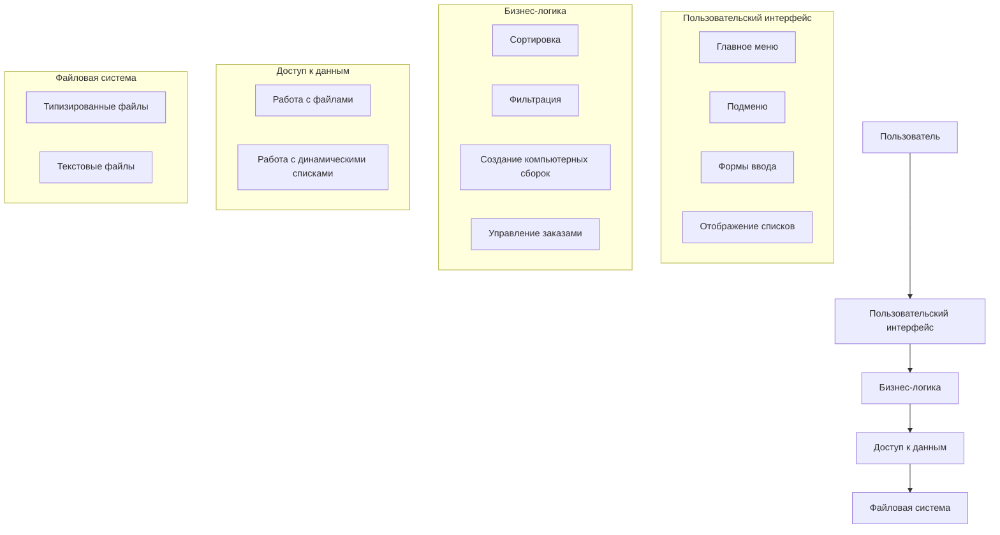
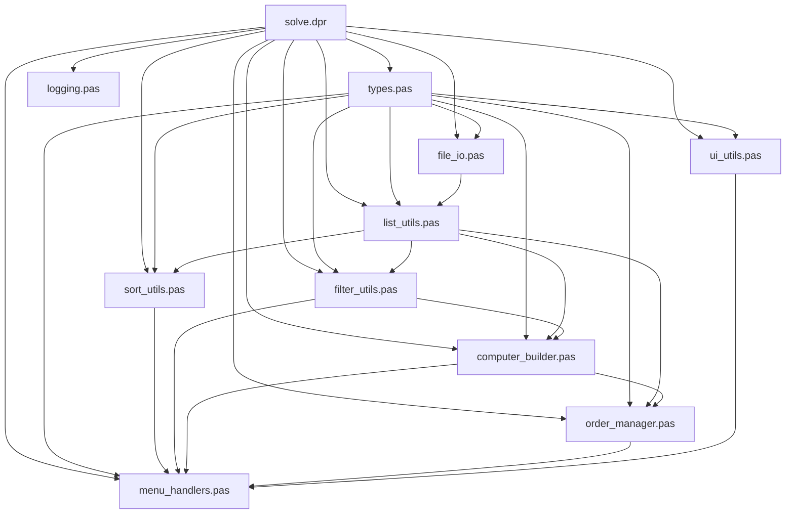
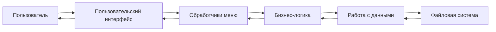
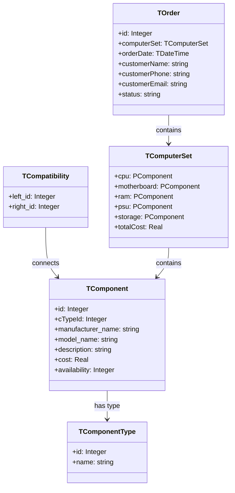
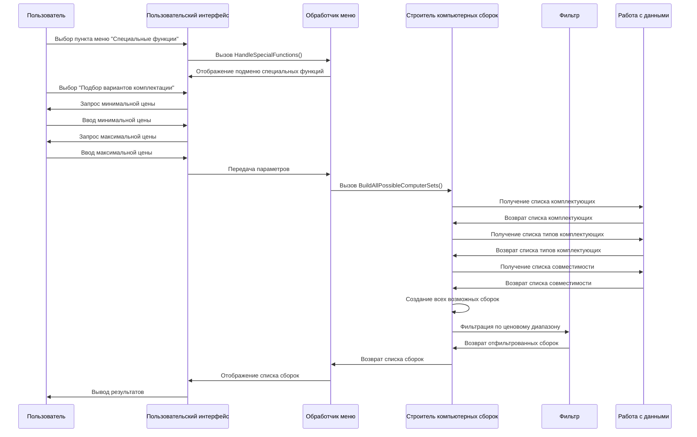
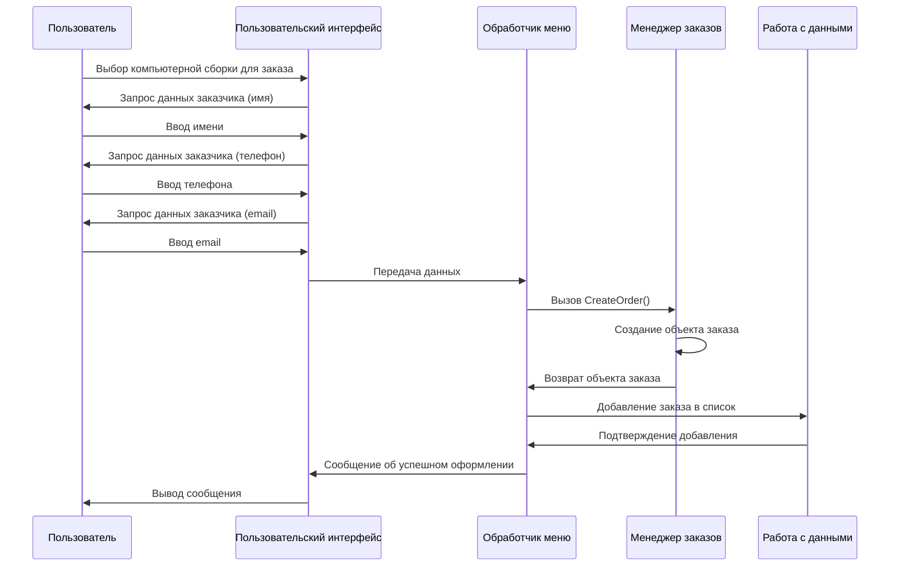
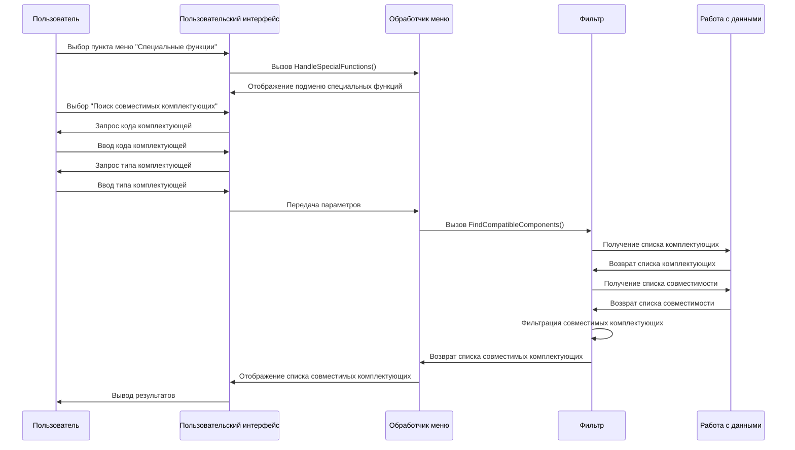
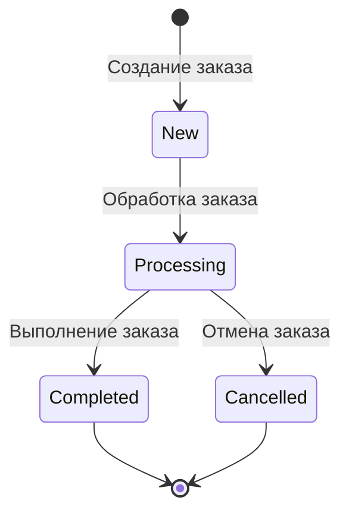
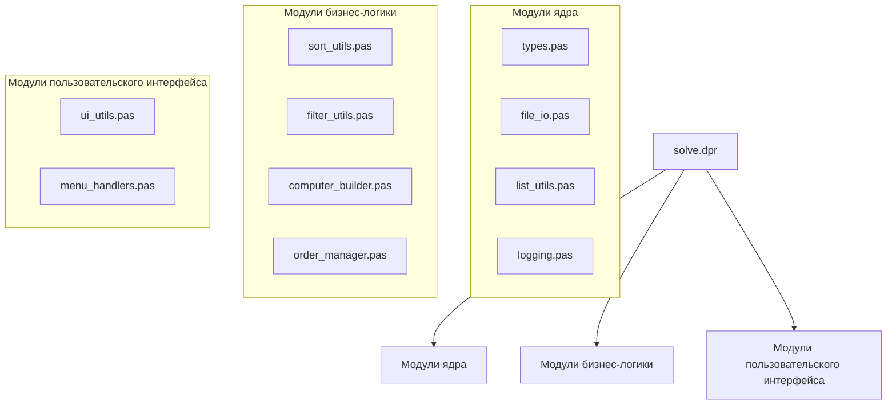

# Диаграммы архитектуры системы

## 1. Общая архитектура системы



## 2. Структура модулей системы



## 3. Диаграмма потока данных



## 4. Диаграмма классов (структур данных)



## 5. Диаграмма последовательности для подбора компьютерных сборок



## 6. Диаграмма последовательности для оформления заказа



## 7. Диаграмма последовательности для поиска совместимых комплектующих



## 8. Диаграмма состояний для заказа



## 9. Диаграмма компонентов системы



## 10. Диаграмма развертывания

```mermaid
graph TD
    A[Компьютер пользователя] --> B[Операционная система]
    B --> C[Free Pascal Compiler]
    C --> D[ComputerPartsManager]
    
    subgraph "ComputerPartsManager"
        D1[Исполняемый файл]
        D2[Типизированные файлы данных]
        D3[Текстовые файлы отчетов]
    end
