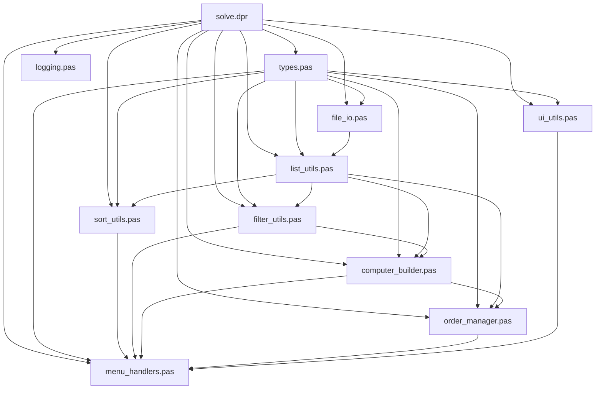

# План реализации

## 1. Определение структур данных

### 1.1. Модуль `types.pas`
Создание модуля с определением основных типов данных:

```pascal
unit types;

interface

type
  // Тип комплектующей
  TComponentType = record
    id: Integer;
    name: string;
  end;
  PComponentType = ^TComponentType;
  TComponentTypeList = ^TComponentTypeNode;
  TComponentTypeNode = record
    data: TComponentType;
    next: TComponentTypeList;
  end;

  // Комплектующая
  TComponent = record
    id: Integer;
    cTypeId: Integer;
    manufacturer_name: string;
    model_name: string;
    description: string;
    cost: Real;
    availability: Integer;
  end;
  PComponent = ^TComponent;
  TComponentList = ^TComponentNode;
  TComponentNode = record
    data: TComponent;
    next: TComponentList;
  end;

  // Совместимость комплектующих
  TCompatibility = record
    left_id: Integer;
    right_id: Integer;
  end;
  PCompatibility = ^TCompatibility;
  TCompatibilityList = ^TCompatibilityNode;
  TCompatibilityNode = record
    data: TCompatibility;
    next: TCompatibilityList;
  end;

  // Компьютерная сборка
  TComputerSet = record
    cpu: PComponent;
    motherboard: PComponent;
    ram: PComponent;
    psu: PComponent;
    storage: PComponent;
    totalCost: Real;
  end;
  PComputerSet = ^TComputerSet;
  TComputerSetList = ^TComputerSetNode;
  TComputerSetNode = record
    data: TComputerSet;
    next: TComputerSetList;
  end;

  // Заказ
  TOrder = record
    id: Integer;
    computerSet: TComputerSet;
    orderDate: TDateTime;
    customerName: string;
    customerPhone: string;
    customerEmail: string;
    status: string; // 'new', 'processing', 'completed', 'cancelled'
  end;
  POrder = ^TOrder;
  TOrderList = ^TOrderNode;
  TOrderNode = record
    data: TOrder;
    next: TOrderList;
  end;
```

## 2. Реализация модулей для работы с данными

### 2.1. Модуль `file_io.pas`
Модуль для работы с типизированными файлами:

```pascal
unit file_io;

interface

uses
  SysUtils, types;

// Функции для работы с файлом типов комплектующих
procedure LoadComponentTypes(var list: TComponentTypeList; const filename: string);
procedure SaveComponentTypes(const list: TComponentTypeList; const filename: string);

// Функции для работы с файлом комплектующих
procedure LoadComponents(var list: TComponentList; const filename: string);
procedure SaveComponents(const list: TComponentList; const filename: string);

// Функции для работы с файлом совместимости
procedure LoadCompatibility(var list: TCompatibilityList; const filename: string);
procedure SaveCompatibility(const list: TCompatibilityList; const filename: string);

// Функции для работы с файлом заказов
procedure LoadOrders(var list: TOrderList; const filename: string);
procedure SaveOrders(const list: TOrderList; const filename: string);
```

### 2.2. Модуль `list_utils.pas`
Модуль с утилитами для работы с динамическими списками:

```pascal
unit list_utils;

interface

uses
  SysUtils, types;

// Функции для работы со списком типов комплектующих
function CreateComponentTypeNode(const data: TComponentType): TComponentTypeList;
procedure AddComponentType(var list: TComponentTypeList; const data: TComponentType);
procedure RemoveComponentType(var list: TComponentTypeList; id: Integer);
function FindComponentType(const list: TComponentTypeList; id: Integer): PComponentType;
procedure ClearComponentTypeList(var list: TComponentTypeList);

// Функции для работы со списком комплектующих
function CreateComponentNode(const data: TComponent): TComponentList;
procedure AddComponent(var list: TComponentList; const data: TComponent);
procedure RemoveComponent(var list: TComponentList; id: Integer);
function FindComponent(const list: TComponentList; id: Integer): PComponent;
procedure ClearComponentList(var list: TComponentList);

// Функции для работы со списком совместимости
function CreateCompatibilityNode(const data: TCompatibility): TCompatibilityList;
procedure AddCompatibility(var list: TCompatibilityList; const data: TCompatibility);
procedure RemoveCompatibility(var list: TCompatibilityList; left_id, right_id: Integer);
function FindCompatibility(const list: TCompatibilityList; left_id, right_id: Integer): PCompatibility;
procedure ClearCompatibilityList(var list: TCompatibilityList);

// Функции для работы со списком компьютерных сборок
function CreateComputerSetNode(const data: TComputerSet): TComputerSetList;
procedure AddComputerSet(var list: TComputerSetList; const data: TComputerSet);
procedure ClearComputerSetList(var list: TComputerSetList);

// Функции для работы со списком заказов
function CreateOrderNode(const data: TOrder): TOrderList;
procedure AddOrder(var list: TOrderList; const data: TOrder);
procedure RemoveOrder(var list: TOrderList; id: Integer);
function FindOrder(const list: TOrderList; id: Integer): POrder;
procedure ClearOrderList(var list: TOrderList);
```

### 2.3. Модуль `sort_utils.pas`
Модуль с функциями сортировки:

```pascal
unit sort_utils;

interface

uses
  SysUtils, types;

// Сортировка списка комплектующих
procedure SortComponentsByPrice(var list: TComponentList; ascending: Boolean);
procedure SortComponentsByManufacturer(var list: TComponentList);
procedure SortComponentsByModel(var list: TComponentList);
procedure SortComponentsByType(var list: TComponentList);

// Сортировка списка компьютерных сборок
procedure SortComputerSetsByPrice(var list: TComputerSetList; ascending: Boolean);
```

### 2.4. Модуль `filter_utils.pas`
Модуль с функциями фильтрации:

```pascal
unit filter_utils;

interface

uses
  SysUtils, types;

// Фильтрация списка комплектующих
function FilterComponentsByType(const list: TComponentList; typeId: Integer): TComponentList;
function FilterComponentsByPriceRange(const list: TComponentList; minPrice, maxPrice: Real): TComponentList;
function FilterComponentsByManufacturer(const list: TComponentList; const manufacturer: string): TComponentList;
function FilterComponentsByAvailability(const list: TComponentList; available: Boolean): TComponentList;

// Фильтрация списка компьютерных сборок
function FilterComputerSetsByPriceRange(const list: TComputerSetList; minPrice, maxPrice: Real): TComputerSetList;

// Поиск совместимых комплектующих
function FindCompatibleComponents(const componentsList: TComponentList; const compatibilityList: TCompatibilityList; componentId: Integer; typeId: Integer): TComponentList;
```

## 3. Реализация бизнес-логики

### 3.1. Модуль `computer_builder.pas`
Модуль для создания компьютерных сборок:

```pascal
unit computer_builder;

interface

uses
  SysUtils, types, list_utils, filter_utils;

// Проверка совместимости комплектующих
function AreComponentsCompatible(const compatibilityList: TCompatibilityList; comp1Id, comp2Id: Integer): Boolean;

// Создание всех возможных вариантов компьютерных сборок
function BuildAllPossibleComputerSets(
  const componentsList: TComponentList;
  const componentTypesList: TComponentTypeList;
  const compatibilityList: TCompatibilityList;
  minPrice, maxPrice: Real
): TComputerSetList;

// Создание компьютерной сборки
function CreateComputerSet(
  cpu, motherboard, ram, psu, storage: PComponent
): TComputerSet;

// Расчет общей стоимости компьютерной сборки
function CalculateTotalCost(const computerSet: TComputerSet): Real;
```

### 3.2. Модуль `order_manager.pas`
Модуль для управления заказами:

```pascal
unit order_manager;

interface

uses
  SysUtils, types, list_utils;

// Создание нового заказа
function CreateOrder(
  const computerSet: TComputerSet;
  const customerName, customerPhone, customerEmail: string
): TOrder;

// Добавление заказа в список
procedure PlaceOrder(var ordersList: TOrderList; const order: TOrder);

// Изменение статуса заказа
procedure UpdateOrderStatus(var order: POrder; const newStatus: string);

// Получение следующего ID для заказа
function GetNextOrderId(const ordersList: TOrderList): Integer;
```

## 4. Реализация пользовательского интерфейса

### 4.1. Модуль `ui_utils.pas`
Модуль с утилитами для пользовательского интерфейса:

```pascal
unit ui_utils;

interface

uses
  SysUtils, Crt, types;

// Функции для отображения меню
procedure ShowMainMenu;
procedure ShowComponentTypesMenu;
procedure ShowComponentsMenu;
procedure ShowCompatibilityMenu;
procedure ShowSpecialFunctionsMenu;

// Функции для отображения списков
procedure DisplayComponentTypesList(const list: TComponentTypeList);
procedure DisplayComponentsList(const list: TComponentList);
procedure DisplayCompatibilityList(const list: TCompatibilityList; const componentsList: TComponentList);
procedure DisplayComputerSetsList(const list: TComputerSetList);
procedure DisplayOrdersList(const list: TOrderList);

// Функции для ввода данных
function SafeReadInteger(const prompt: string; min, max: Integer): Integer;
function SafeReadReal(const prompt: string; min, max: Real): Real;
function SafeReadString(const prompt: string; maxLength: Integer): string;
function SafeReadBoolean(const prompt: string): Boolean;
procedure WaitForKey;
```

### 4.2. Модуль `menu_handlers.pas`
Модуль с обработчиками пунктов меню:

```pascal
unit menu_handlers;

interface

uses
  SysUtils, Crt, types, list_utils, file_io, sort_utils, filter_utils, computer_builder, order_manager, ui_utils;

// Обработчики пунктов главного меню
procedure HandleReadFromFile(
  var componentTypesList: TComponentTypeList;
  var componentsList: TComponentList;
  var compatibilityList: TCompatibilityList;
  var ordersList: TOrderList
);

procedure HandleViewList(
  const componentTypesList: TComponentTypeList;
  const componentsList: TComponentList;
  const compatibilityList: TCompatibilityList;
  const ordersList: TOrderList
);

procedure HandleSortData(
  var componentsList: TComponentList;
  var computerSetsList: TComputerSetList
);

procedure HandleSearchWithFilters(
  const componentsList: TComponentList;
  const componentTypesList: TComponentTypeList;
  const compatibilityList: TCompatibilityList
);

procedure HandleAddData(
  var componentTypesList: TComponentTypeList;
  var componentsList: TComponentList;
  var compatibilityList: TCompatibilityList
);

procedure HandleRemoveData(
  var componentTypesList: TComponentTypeList;
  var componentsList: TComponentList;
  var compatibilityList: TCompatibilityList
);

procedure HandleEditData(
  var componentTypesList: TComponentTypeList;
  var componentsList: TComponentList;
  var compatibilityList: TCompatibilityList
);

procedure HandleSpecialFunctions(
  const componentsList: TComponentList;
  const componentTypesList: TComponentTypeList;
  const compatibilityList: TCompatibilityList;
  var ordersList: TOrderList;
  var computerSetsList: TComputerSetList
);

procedure HandleSaveToFile(
  const componentTypesList: TComponentTypeList;
  const componentsList: TComponentList;
  const compatibilityList: TCompatibilityList;
  const ordersList: TOrderList
);
```

## 5. Интеграция всех компонентов

### 5.1. Обновление основного файла программы `solve.dpr`

```pascal
program Solve;

uses
  SysUtils, Crt,
  logging in './src/logging.pas',
  types in './src/types.pas',
  file_io in './src/file_io.pas',
  list_utils in './src/list_utils.pas',
  sort_utils in './src/sort_utils.pas',
  filter_utils in './src/filter_utils.pas',
  computer_builder in './src/computer_builder.pas',
  order_manager in './src/order_manager.pas',
  ui_utils in './src/ui_utils.pas',
  menu_handlers in './src/menu_handlers.pas';

var
  choice: Integer;
  exitProgram: Boolean;
  exitWithSave: Boolean;
  log: TLogF;
  
  // Списки данных
  componentTypesList: TComponentTypeList;
  componentsList: TComponentList;
  compatibilityList: TCompatibilityList;
  ordersList: TOrderList;
  computerSetsList: TComputerSetList;

begin
  log := GetLogger(LL_DEBUG);
  exitProgram := False;
  exitWithSave := False;
  
  // Инициализация списков
  componentTypesList := nil;
  componentsList := nil;
  compatibilityList := nil;
  ordersList := nil;
  computerSetsList := nil;
  
  while not exitProgram do
  begin
    ShowMainMenu;
    choice := SafeReadInteger('Выберите пункт меню: ', 1, 10);
    
    case choice of
      1: begin // Чтение данных из файла
        HandleReadFromFile(componentTypesList, componentsList, compatibilityList, ordersList);
        WaitForKey;
      end;
      2: begin // Просмотр всего списка
        HandleViewList(componentTypesList, componentsList, compatibilityList, ordersList);
        WaitForKey;
      end;
      3: begin // Сортировка данных
        HandleSortData(componentsList, computerSetsList);
        WaitForKey;
      end;
      4: begin // Поиск данных с использованием фильтров
        HandleSearchWithFilters(componentsList, componentTypesList, compatibilityList);
        WaitForKey;
      end;
      5: begin // Добавление данных в список
        HandleAddData(componentTypesList, componentsList, compatibilityList);
        WaitForKey;
      end;
      6: begin // Удаление данных из списка
        HandleRemoveData(componentTypesList, componentsList, compatibilityList);
        WaitForKey;
      end;
      7: begin // Редактирование данных
        HandleEditData(componentTypesList, componentsList, compatibilityList);
        WaitForKey;
      end;
      8: begin // Специальные функции
        HandleSpecialFunctions(componentsList, componentTypesList, compatibilityList, ordersList, computerSetsList);
        WaitForKey;
      end;
      9: begin // Выход из программы без сохранения изменений
        exitProgram := True;
      end;
      10: begin // Выход с сохранением изменений
        HandleSaveToFile(componentTypesList, componentsList, compatibilityList, ordersList);
        exitProgram := True;
      end;
    end;
  end;
  
  // Освобождение памяти
  ClearComponentTypeList(componentTypesList);
  ClearComponentList(componentsList);
  ClearCompatibilityList(compatibilityList);
  ClearOrderList(ordersList);
  ClearComputerSetList(computerSetsList);
  
  WriteLn('Программа завершена.');
end.
```

## 6. План тестирования

### 6.1. Тестирование модулей
1. Тестирование модуля `types.pas` - проверка корректности определения типов данных
2. Тестирование модуля `file_io.pas` - проверка корректности чтения и записи данных в файлы
3. Тестирование модуля `list_utils.pas` - проверка корректности работы с динамическими списками
4. Тестирование модуля `sort_utils.pas` - проверка корректности сортировки данных
5. Тестирование модуля `filter_utils.pas` - проверка корректности фильтрации данных
6. Тестирование модуля `computer_builder.pas` - проверка корректности создания компьютерных сборок
7. Тестирование модуля `order_manager.pas` - проверка корректности создания и управления заказами
8. Тестирование модуля `ui_utils.pas` - проверка корректности отображения пользовательского интерфейса
9. Тестирование модуля `menu_handlers.pas` - проверка корректности обработки пунктов меню

### 6.2. Интеграционное тестирование
1. Тестирование взаимодействия модулей `file_io.pas` и `list_utils.pas`
2. Тестирование взаимодействия модулей `sort_utils.pas` и `filter_utils.pas`
3. Тестирование взаимодействия модулей `computer_builder.pas` и `order_manager.pas`
4. Тестирование взаимодействия модулей `ui_utils.pas` и `menu_handlers.pas`

### 6.3. Системное тестирование
1. Тестирование всех пунктов меню
2. Тестирование специальных функций
3. Тестирование обработки ошибок
4. Тестирование производительности

## 7. Этапы реализации

### 7.1. Этап 1: Базовая структура
1. Создание модуля `types.pas`
2. Создание модуля `file_io.pas`
3. Создание модуля `list_utils.pas`
4. Обновление основного файла программы `solve.dpr`

### 7.2. Этап 2: Бизнес-логика
1. Создание модуля `sort_utils.pas`
2. Создание модуля `filter_utils.pas`
3. Создание модуля `computer_builder.pas`
4. Создание модуля `order_manager.pas`

### 7.3. Этап 3: Пользовательский интерфейс
1. Создание модуля `ui_utils.pas`
2. Создание модуля `menu_handlers.pas`
3. Интеграция всех компонентов

### 7.4. Этап 4: Тестирование и отладка
1. Тестирование модулей
2. Интеграционное тестирование
3. Системное тестирование
4. Отладка и исправление ошибок

### 7.5. Этап 5: Документация
1. Создание руководства по установке
2. Создание руководства по эксплуатации
3. Подготовка отчета

## 8. Диаграмма архитектуры системы



## 9. Диаграмма потока данных


## 10. Заключение

Данный план реализации описывает структуру и компоненты системы для управления компьютерными комплектующими. Система будет построена по принципам Feature-Sliced Design с разделением на слои и сегменты. Реализация будет выполнена на языке Pascal с использованием типизированных файлов и динамических списков.

Основные функциональные возможности системы:
1. Управление комплектующими, их типами и совместимостью
2. Подбор вариантов комплектации компьютера в заданном ценовом диапазоне
3. Оформление заказа понравившегося варианта
4. Вывод комплектующих заданного типа, совместимых с конкретным комплектующим

Реализация будет выполнена в несколько этапов, начиная с базовой структуры и заканчивая тестированием и документацией.
